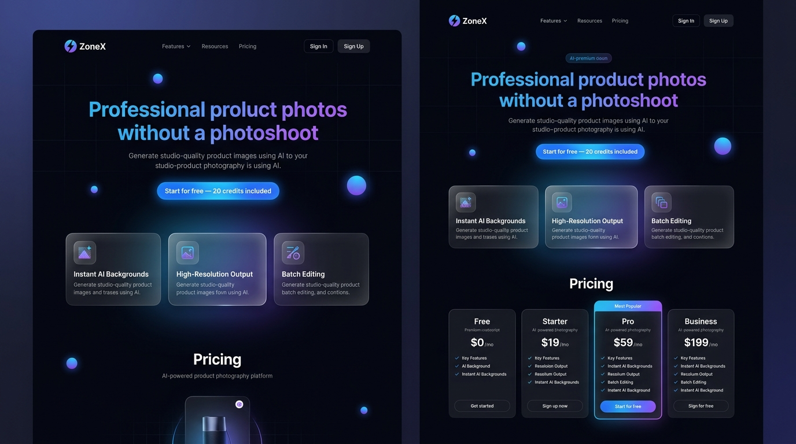

 <div align="center">

# ✨ ZoneX
### AI Product Photography & Model Studio

**Create photorealistic product photos and synthetic model photoshoots for e‑commerce — no physical studio required.**



<sub>🖼️ ZoneX landing page — work in progress</sub>

<br/>

[](https://zonex-virid.vercel.app)
[]()
[]()
[]()
[]()

</div>

---

## 📖 Table of Contents

- [Highlights](#-highlights)
- [Quick Start](#-quick-start)
- [Scripts](#-scripts)
- [Tech Stack](#-tech-stack)
- [Project Layout](#-project-layout)
- [Features](#-features-mvp)
- [Deployment](#-deployment)
- [Contributing](#-contributing)
- [Author](#-author)
- [License](#-license)

---

## 🚀 Highlights

| | |
|---|---|
| 🎛️ **Mock Mode** | Explore the full UI without needing any API keys |
| 🖼️ **Pluggable Image Gen** | Swap in fal.ai / FLUX for generation, plus background removal & upscaling |
| 🔐 **Production-Ready Flows** | Built-in auth, project management, and billing scaffolding out of the box |

---

## ✨ Quick Start

**1. Install dependencies**

```bash
npm install
```

**2. Configure environment**

```bash
cp .env.local.example .env.local
# set NEXT_PUBLIC_MOCK_MODE=false to enable live providers
```

**3. Run the dev server**

```bash
npm run dev
```

Then open **[http://localhost:3000](http://localhost:3000)** to view the app locally.

---

## 🧾 Scripts

| Command | Description |
|---|---|
| `npm run dev` | Start the local development server |
| `npm run build` | Build the app for production |
| `npm run start` | Start the production build |

---

## 🧩 Tech Stack

<table>
<tr><td><b>Framework</b></td><td>Next.js (App Router)</td></tr>
<tr><td><b>Language</b></td><td>TypeScript</td></tr>
<tr><td><b>Styling</b></td><td>Tailwind CSS + custom styles</td></tr>
<tr><td><b>Image Generation</b></td><td>fal.ai (FLUX), rembg, ESRGAN</td></tr>
<tr><td><b>Auth</b></td><td>Clerk</td></tr>
<tr><td><b>Database</b></td><td>Neon Postgres + Drizzle ORM</td></tr>
<tr><td><b>Storage</b></td><td>Vercel Blob</td></tr>
<tr><td><b>Payments</b></td><td>Stripe <i>(optional)</i></td></tr>
</table>

---

## 🗂️ Project Layout

```
zonex/
├── app/          # Next.js routes & layouts
├── components/   # UI components
├── lib/          # API wrappers, utilities, server actions
└── db/           # Drizzle schema + client
```

---

## ✅ Features (MVP)

- 🏠 Landing & marketing pages
- 🔑 Auth (sign-up / sign-in)
- 📊 Dashboard with recent generations & projects
- 🛍️ Product photo generation flow — *upload → generate → before/after → download*
- 🧍 Synthetic model photoshoot flow
- 🎭 Mock mode for demoing without API keys

---

## 📦 Deployment

Deploy instantly to **Vercel** for automatic previews on every branch.

🔗 **Live preview:** [zonex-virid.vercel.app](https://zonex-virid.vercel.app)

---

## 🤝 Contributing

Contributions are welcome!

1. Open an issue describing the change or bug
2. Include clear, reproducible steps
3. Follow the existing TypeScript & linting conventions
4. Submit a PR 🎉

---

## 👤 Author -> KASHIF HAFEEZ 

<table>

<tr><td>📧 <b>Email</b></td><td><a href="mailtokashif.hafeez.dev@gmail.com">kashif.hafeez.dev@gmail.com</a></td></tr>
<tr><td>🌐 <b>Portfolio</b></td><td><a href="https://kashifhafeez-portfolio1.vercel.app/">kashifhafeez-portfolio1.vercel.app</a></td></tr>
<tr><td>🆔 <b>ORCID</b></td><td><a href="https://orcid.org/0009-0002-5604-3264">0009-0002-5604-3264</a></td></tr>
<tr><td>💼 <b>LinkedIn</b></td><td><a href="https://linkedin.com/in/kashif-hafeez-545794330">kashif-hafeez</a></td></tr>
<tr><td>📸 <b>Instagram</b></td><td><a href="https://www.instagram.com/i_kashiif">@i_kashiif</a></td></tr>
<tr><td>👥 <b>Facebook</b></td><td><a href="https://www.facebook.com/share/1AZ6rpfhxb/">Facebook Profile</a></td></tr>
</table>

> ⚠️ **Status:** This project is not complete — still a work in progress.

---

## 📜 License

Released under the **[MIT License](LICENSE)**.

<div align="center">
<sub>Made with❤️ by KashifHafeez</sub>
</div>
